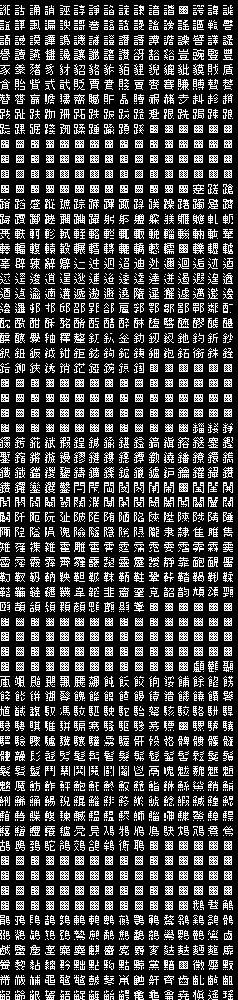

# bs-font-engine

PVSnesLib project implementation of the bs font.

Work in progress

Supports single-byte ascii and two-byte shift-jis.

# Font Mapping

Font provided in the BS-X bios. 
This font is mostly mapped on the [Shift-JIS](https://en.wikipedia.org/wiki/Shift_JIS) standard where every character is coded by two bytes. 

The narrow latin alphabet seems to be based on one of the [JIS X extension](https://en.wikipedia.org/wiki/Shift_JIS#Other_variants). 
Three characters differ from ASCII: 

0x5C    is ¥ instead of backslash \  
0x60    is a white space instead of backtick ` 
0x7E    is an underscore instead of tilde ~ 

[Shift-JIS Complete Table](http://www.rikai.com/library/kanjitables/kanji_codes.sjis.shtml)

| Offset      | Content                           | Comment                                                                                  |
|-------------|-----------------------------------|------------------------------------------------------------------------------------------|
| 48000-50000 |  | Kanjis: 88 9F 89 40 8A 40 8B 40 - 8B 5B                                  |
| 50000-58000 |  | Kanjis: 8B 5C - 8B xx 8C 40 8D 40 8E 40 8F 40 90 40 - 90 B0  |
| 58000-60000 |  | Kanjis: 90 B1 - 90 xx 91 40 92 40 93 40 94 40 95 40              |
| 60000-68000 |  | Kanjis: 96 40 97 40 98 40 99 40 9A 40 9B 40                      |
| 68000-70000 |  | Kanjis: 9C 40 9D 40 9E 40 9F 40 E0 40                                |
| 70000-78000 |  | Kanjis: E1 40 E2 40 E3 40 E4 40 E5 40 E6 40                      |
| 78000-80000 |  | Kanjis: E7 40 E8 40 E9 40 EA 40                                          |
